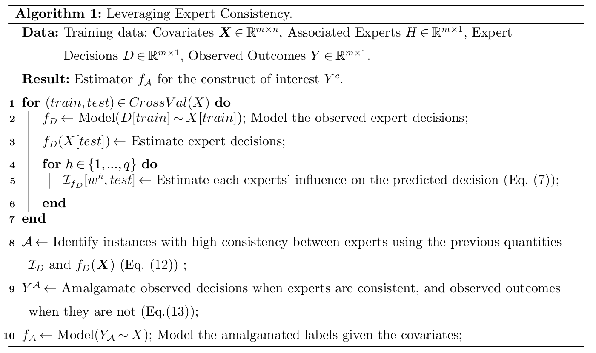

# Leveraging Expert Consistency to Improve Algorithmic Decision Support
This repository implements the methodology proposed in [Leveraging Expert Consistency to Improve Algorithmic Decision Support](https://arxiv.org/pdf/2101.09648.pdf). The proposed approach leverages influence functions to estimate the consistency of multiple experts when a single expert evaluates each instance in the training. This information is then leveraged to learn from experts when there is inferred expert consistency and from observed labels otherwise. Combining the expert decisions and the observed outcomes improves the quality of the labels used to train the models, making these labels closer to the construct experts aim to optimise for.

## Summary of the approach
The proposed appraoch can be summarised as follows:



## How to use ?
The following steps are an implementation of the previous algorthim:
```python
# Create model f_D to model human decision
f_D = BinaryMLP(**params)
f_D = f_D.fit(X_train, D_train, H_train)

# Estimate influence on training set for each instance in X_train
folds, predictions, influence = influence_cv(BinaryMLP, X_train, D_train, H_train, params = params, l1_penalties = [0.001, 0.01, 0.1, 1])

# Compute metrics to estimate consistency among experts
center_metric, opposing_metric = compute_agreeability(influence, predictions)

# Amalgamate observed decision and outcomes
high_conf = (predictions > (1 - delta)) | (predictions < delta)

flat_influence = (np.abs(influence) > gamma_3).sum(0) == 0
high_agr = (((center_metric > gamma_1) & (opposing_metric > gamma_2)) | flat_influence) & high_conf
high_agr_correct = ((predictions - tar_train['D']).abs() < delta) & high_agr

A = Y.copy()
A[high_agr_correct] = D_train[high_agr_correct]
index_amalg = (D == 1) | high_agr_correct # Selective labels

# Train a model f_A on the amalgameted labels
f_A = BinaryMLP(**params)
f_A = f_A.fit(X_train[index_amalg], A[index_amalg], H[index_amalg])
```

A full example on the MIMIC dataset is described in `example/Triage - MIMIC.ipynb` to reproduce the paper's semi-syntheitc results and a tutorial describes how to use the model and choose parameters in `Tutorial.ipynb` for using on your own dataset.

## Reproduce paper's MIMIC results
To reproduce the paper's results:

0. Clone the repository with dependencies: `git clone git@github.com:mariadea/influence-labelers.git`.
1. Create a conda environment with `python>=3.10` all necessary libraries `pytorch>=2.2.2`, `pandas>=2.2.1`, `numpy>=1.26.4`.
2. Download the [MIMIC ED](https://physionet.org/content/mimic-iv-ed/2.2/) dataset and extracts data and synthetic labels following `data/Triage - MIMIC - Preprocessing.ipynb`.
3. Then run the different models following `example/Triage - MIMIC.ipynb` -- `example/k_experiments.py` allows to run k iterations of this same set of experiments in command line.
5. Analyse the results using `Analysis - MIMIC.ipynb` to reproduce all figures and tables in the paper.

# Setup
## Structure

### model/
This folder contains the neural network model, influence function and amalgamation functions necessary to implement the model.
- `amalgamation.py` contains all the functions to approximate consensus and compute the amalgamation set given the following neural network and xgboost appraoches.
- `neural_api.py` is the object to create a neural network, relying on the model described in `neural_torch.py`, trained using the loss in `loss.py`.
- `xgboost_api.py` similarly allows to use a xgboost approach for our model.

Finally `defer.py` is an implementation of a learn to defer appraoch that defers to humans when there is estimated expert consistency.

### example/
This folder contains the scripts used to run the experiment and analyze the results. Execute `run_all.sh` to reproduce all MIMIC experiments, then analyse them using `Analysis - MIMIC.ipynb`

### data/
This folder contains the script to extract the vital signs from MIMIC ED dataset and generate the semi synthetic labels. 

## Clone
```
git clone git@github.com:mariadea/influence-labelers.git
```

## Requirements
The model and baselines rely on `cleanlab`, `pytorch`, `pandas`, `numpy`, `sklearn`, `tqdm` and `xgboost`.  
To analyze the results `matplotlib` is necessary.
